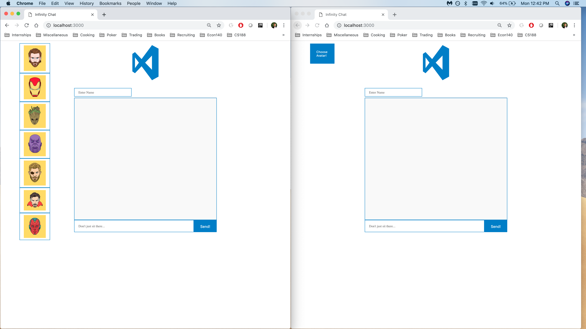
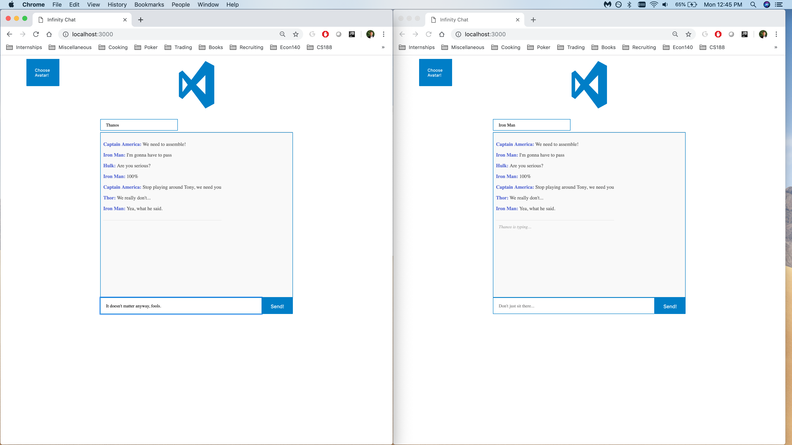
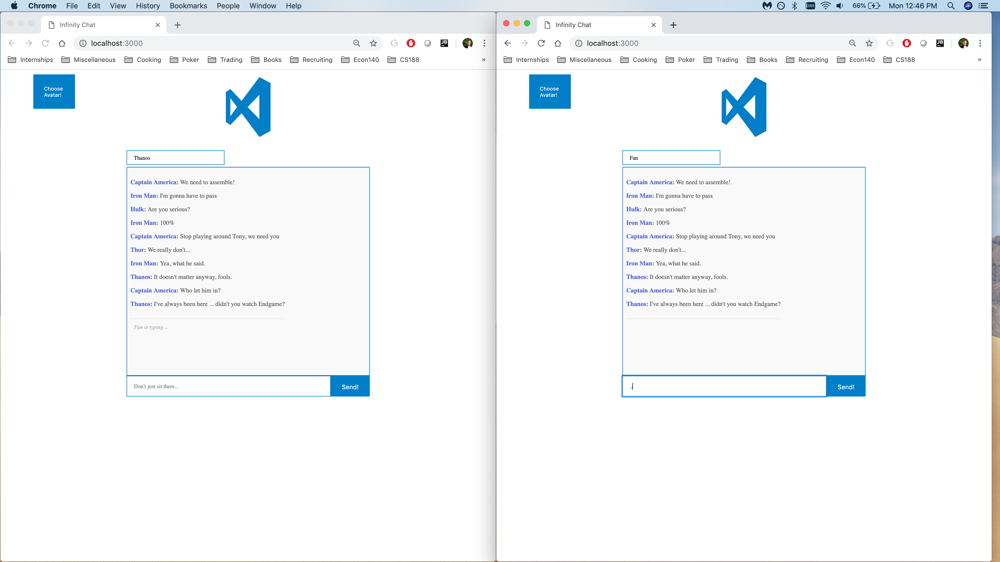
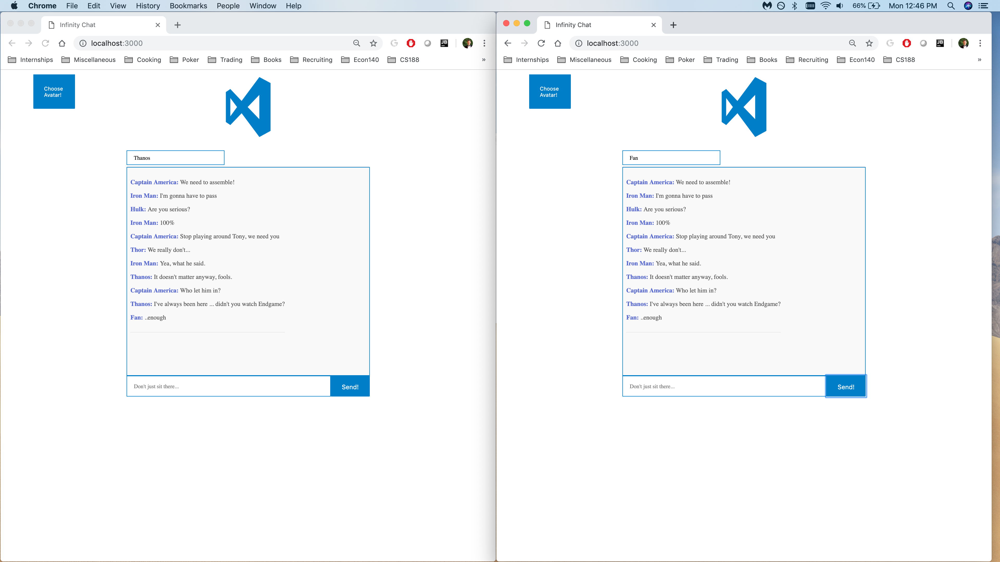

# Chat App
A small chat app that I built over a couple of hours for a start-up I was interviewing with, by using Javascript, CSS, & Socket.io

Version 1.0: Basic functionality implemented

Drop down menu to select your avatar

-------------------
Live connection allows you to see when others are typing messages

-------------------

Supports multiple users

-------------------
